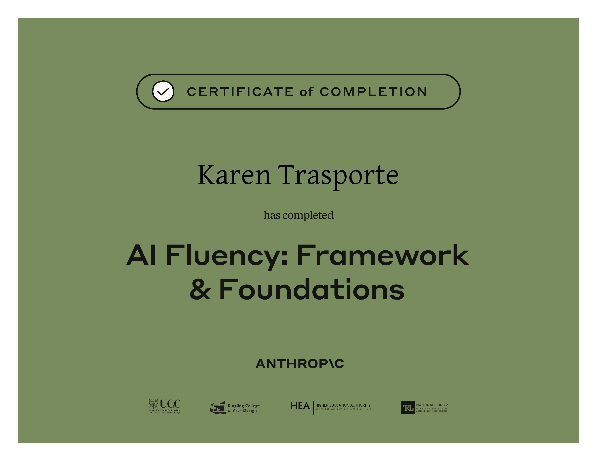

# My Professional Profile Site

A personal profile site built with Flask and deployed via a full CI/CD pipeline. This project was built together with Claude to learn Python and DevOps as a hands-on exercise of the Anthropic course AI Fluency: Framework and Foundations. 

🌐 **Live site:** http://188.166.253.218:4000 (Server currently turned off)   
📦 **Docker Hub:** https://hub.docker.com/r/karentrasporte/my-profile



---

## Tech Stack

| Layer | Technology |
|---|---|
| Web framework | Python / Flask |
| Containerization | Docker + Docker Compose |
| CI/CD | Jenkins (running in Docker) |
| Image registry | Docker Hub |
| Hosting | Digital Ocean Droplet (Ubuntu 24.04) |
| Source control | GitHub |

---

## CI/CD Pipeline

Every push to `main` triggers the following pipeline in Jenkins:

```
Developer pushes code to GitHub
       ↓
GitHub webhook triggers Jenkins
       ↓
Jenkins: Checkout code
       ↓
Jenkins: Build multi-platform Docker image (linux/amd64 + linux/arm64)
       ↓
Jenkins: Push image to Docker Hub
       ↓
Jenkins: SSH into Digital Ocean Droplet
       ↓
Droplet: Pull latest image from Docker Hub
       ↓
Droplet: Stop old container, run new container
       ↓
Site is live at http://DROPLET_IP:5000
```

---

## Project Structure

```
profile-site/
│
├── app/
│   ├── __init__.py          # Application factory pattern
│   ├── routes.py            # URL routes and blueprints
│   └── templates/
│       ├── index.html       # Profile page
│       └── learning.html    # What I'm learning page
│
├── tests/
│   └── test_app.py          # Pytest tests
│
├── Dockerfile               # Flask app container
├── Dockerfile.jenkins       # Custom Jenkins image with Docker CLI
├── docker-compose.yml       # Local development (Flask + Jenkins)
├── Jenkinsfile              # CI/CD pipeline definition
├── requirements.txt         # Python dependencies
└── run.py                   # App entry point
```

---

## Running Locally

### Prerequisites
- Docker Desktop
- Git

### Steps

```bash
# Clone the repo
git clone https://github.com/karentrasporte/myprofile.git
cd myprofile

# Start Flask app and Jenkins
docker compose up --build

# Flask app:  http://localhost:5000
# Jenkins UI: http://localhost:8080
```

---

## What I Learned

- **Flask** — application factory pattern, Blueprints, Jinja2 templating
- **Docker** — Dockerfiles, layer caching, multi-platform builds with `buildx`
- **Docker Compose** — running multiple containers as one unit
- **Jenkins** — pipeline as code, credentials management, Docker-in-Jenkins
- **Linux/DevOps** — `systemctl`, `lsof`, SSH key auth, firewall configuration
- **GitHub** — webhooks, SSH authentication, conventional commits
- **Digital Ocean** — Droplet setup, deploying containerized apps

---

## Author

Karen Trasporte  
[LinkedIn](https://www.linkedin.com/in/katrasporte/) · [GitHub](https://github.com/karentrasporte)
